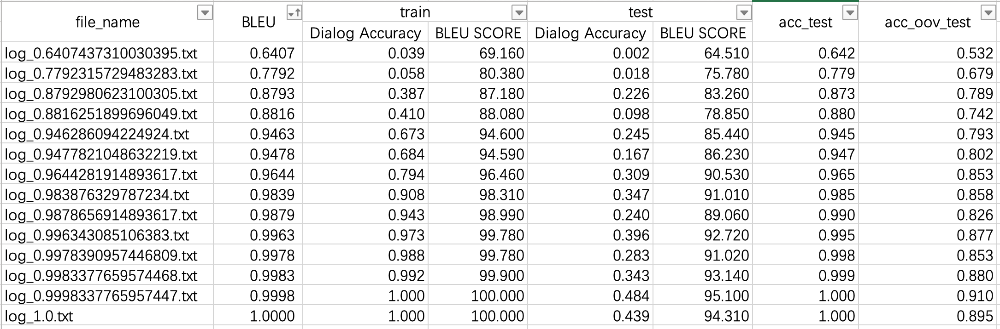

2020-04-20 11:45:16

分析测试结果，看看bleu值和准确率的关系
```
/Users/huihui/git/Mem2Seq/env/bin/python /Users/huihui/git/Mem2Seq/log_Mem2Seq_babi_1/get_bleu_acc.py
```




#  log_0.9477821048632219.txt
04-20 10:33 Dialog Accuracy:	0.684
04-20 10:33 BLEU SCORE:94.59

04-20 10:58 Dialog Accuracy:	0.167
04-20 10:58 BLEU SCORE:86.23

acc_oov_test=0.8022908366533864


# log_0.9983377659574468.txt
04-20 10:33 Dialog Accuracy:	0.992
04-20 10:33 BLEU SCORE:99.9

04-20 10:58 Dialog Accuracy:	0.343
04-20 10:58 BLEU SCORE:93.14

acc_test=0.9986522911051213

acc_oov_test=0.8804780876494024


# log_0.7792315729483283.txt
04-20 10:33 Dialog Accuracy:	0.058

04-20 10:33 BLEU SCORE:80.38

04-20 10:58 Dialog Accuracy:	0.018

04-20 10:58 BLEU SCORE:75.78

acc_test=0.7791442048517521

acc_oov_test=0.6791168658698539

# log_0.9878656914893617.txt
04-20 10:33 Dialog Accuracy:	0.943

04-20 10:33 BLEU SCORE:98.99

04-20 10:58 Dialog Accuracy:	0.24

04-20 10:58 BLEU SCORE:89.06

acc_test=0.9903975741239892

acc_oov_test=0.8256972111553785

# log_0.983876329787234.txt
04-20 10:33 Dialog Accuracy:	0.908

04-20 10:33 BLEU SCORE:98.31

04-20 10:58 Dialog Accuracy:	0.347

04-20 10:58 BLEU SCORE:91.01

acc_test=0.9845013477088949

acc_oov_test=0.8580677290836654

# log_0.8792980623100305.txt
04-20 10:33 Dialog Accuracy:	0.387

04-20 10:33 BLEU SCORE:87.18

04-20 10:57 Dialog Accuracy:	0.226

04-20 10:58 BLEU SCORE:83.26

acc_test=0.8731469002695418

acc_oov_test=0.7888446215139442

# log_0.9998337765957447.txt
04-20 10:33 Dialog Accuracy:	1.0

04-20 10:33 BLEU SCORE:100.0

04-20 10:58 Dialog Accuracy:	0.484

04-20 10:58 BLEU SCORE:95.1

acc_test=1.0

acc_oov_test=0.9098605577689243

# log_0.6407437310030395.txt
04-20 10:32 Dialog Accuracy:	0.039

04-20 10:32 BLEU SCORE:69.16

04-20 10:57 Dialog Accuracy:	0.002

04-20 10:58 BLEU SCORE:64.51

acc_test=0.6418463611859838

acc_oov_test=0.5318725099601593

# log_1.0.txt
04-20 10:33 Dialog Accuracy:	1.0

04-20 10:33 BLEU SCORE:100.0

04-20 10:58 Dialog Accuracy:	0.439

04-20 10:58 BLEU SCORE:94.31

acc_test=1.0

acc_oov_test=0.8945883134130146

# log_0.946286094224924.txt
04-20 10:33 Dialog Accuracy:	0.673

04-20 10:33 BLEU SCORE:94.6

04-20 10:58 Dialog Accuracy:	0.245

04-20 10:58 BLEU SCORE:85.44

acc_test=0.944743935309973

acc_oov_test=0.7933266932270916

# log_0.9644281914893617.txt
04-20 10:32 Dialog Accuracy:	0.794

04-20 10:32 BLEU SCORE:96.46

04-20 10:58 Dialog Accuracy:	0.309

04-20 10:58 BLEU SCORE:90.53

acc_test=0.9652964959568733

acc_oov_test=0.852921646746348

# log_0.9978390957446809.txt
04-20 10:32 Dialog Accuracy:	0.988

04-20 10:32 BLEU SCORE:99.78

04-20 10:58 Dialog Accuracy:	0.283

04-20 10:58 BLEU SCORE:91.02

acc_test=0.9979784366576819

acc_oov_test=0.853253652058433

# log_0.996343085106383.txt
04-20 10:33 Dialog Accuracy:	0.973

04-20 10:33 BLEU SCORE:99.78

04-20 10:58 Dialog Accuracy:	0.396

04-20 10:58 BLEU SCORE:92.72

acc_test=0.9954514824797843

acc_oov_test=0.877324037184595

# log_0.8816251899696049.txt
04-20 10:33 Dialog Accuracy:	0.41

04-20 10:33 BLEU SCORE:88.08

04-20 10:58 Dialog Accuracy:	0.098

04-20 10:58 BLEU SCORE:78.85

acc_test=0.8795485175202157

acc_oov_test=0.7415338645418327


Process finished with exit code 0
